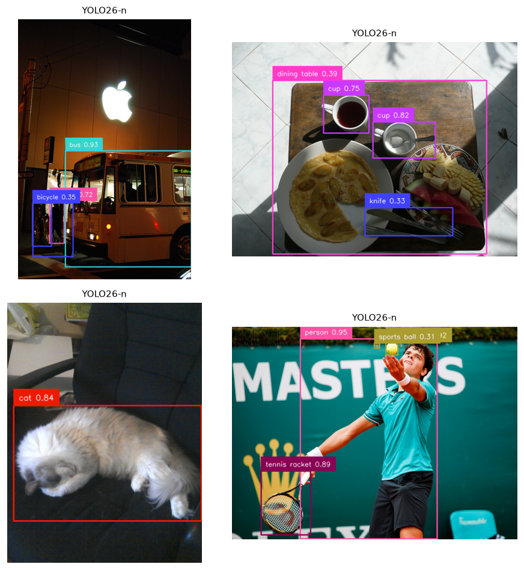
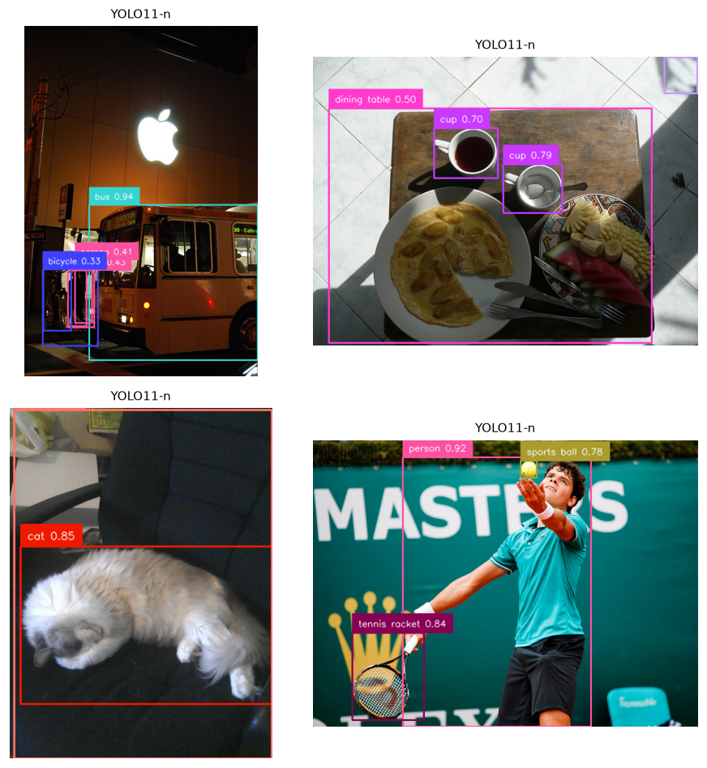
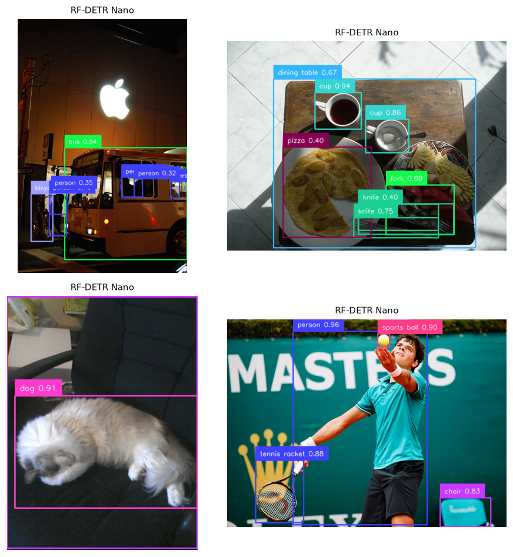
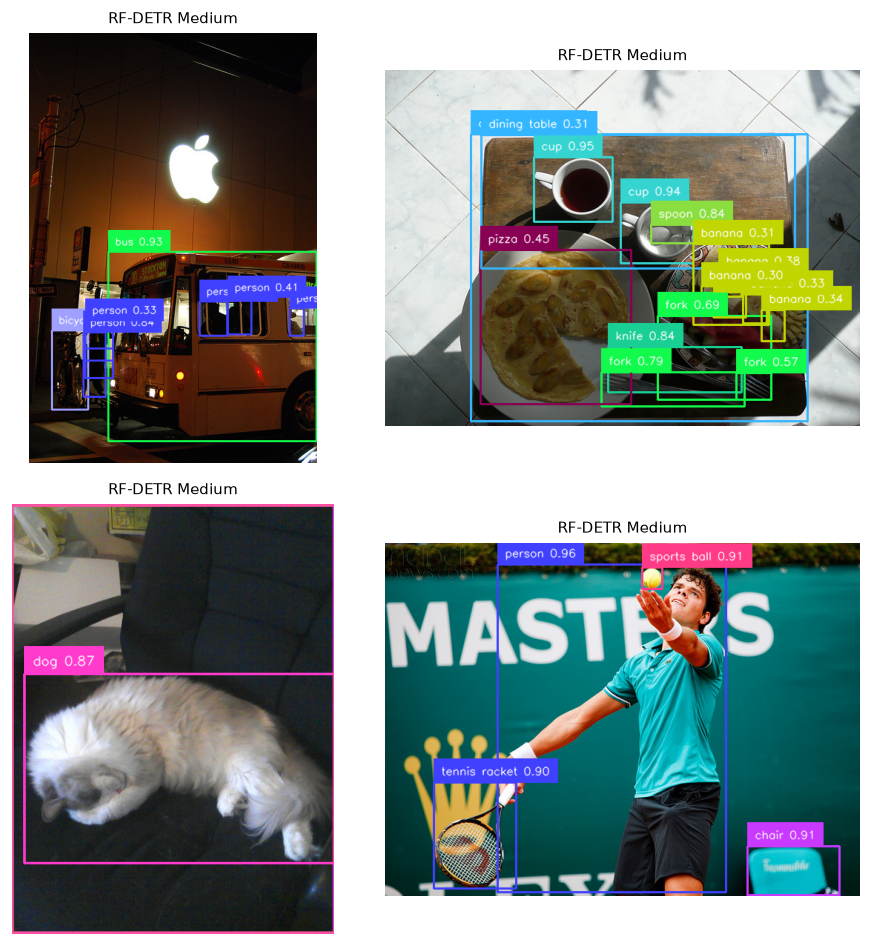
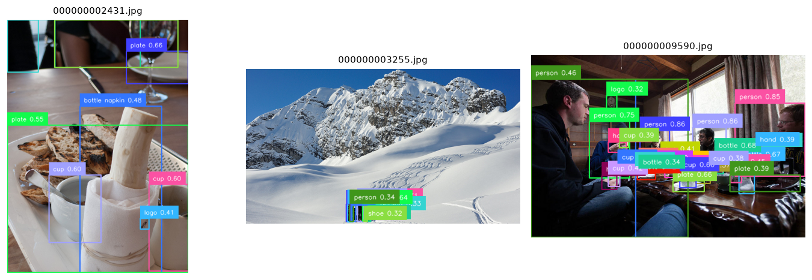

## The task

**Object detection** answers two questions at once: *what* objects are present and
*where* they are, as axis-aligned bounding boxes with class labels and confidence
scores. It sits between **classification** (one label for the whole image) and
**segmentation** (a label for every pixel), and it underpins most real-world
perception — including the robotics work this repo's hardware also serves.

The headline metric is **mean Average Precision (mAP)**: for each class you sweep a
confidence threshold to trace a precision–recall curve, take the area under it
(Average Precision), and average across classes. COCO reports mAP averaged over ten
IoU thresholds from 0.50 to 0.95 (written `mAP@[.50:.95]`), which rewards *tight*
boxes, not just roughly-right ones.

## Two paradigms

The most important idea to carry across this whole curriculum is the split between
**closed-set** and **open-vocabulary** detection:

- **Closed-set** models (YOLO, RF-DETR here) predict from a *fixed* label set — the
  80 COCO classes. Fast, accurate, benchmarkable, but blind to anything off-list.
- **Open-vocabulary** models (Grounding DINO, YOLO-World) take *text* at inference
  time and detect whatever you name — "a forklift", "a person wearing hi-vis" — with
  no retraining. More flexible, generally slower and lower-AP on the fixed COCO set.

This report benchmarks the closed-set models head-to-head (they share the COCO label
space, so mAP is a fair comparison), then demonstrates the open-vocabulary alternative
qualitatively below — it isn't restricted to the 80 COCO names, so a like-for-like mAP
wouldn't be meaningful.

## The architectures benchmarked

| Family | Member(s) | How it localises | Notable trait |
|---|---|---|---|
| **YOLO** | YOLO26-n, YOLO11-n | Dense grid of predictions over a CNN/feature pyramid | YOLO26 is **NMS-free** — it learns to emit one box per object, removing the non-maximum-suppression post-step that older YOLOs need |
| **RF-DETR** | Nano, Medium | A transformer **decoder** with a fixed set of learned "object queries", each attending to the image | DETR-style; no anchors, no NMS by design; built on a DINOv2 backbone |

The interesting contrast: YOLO descends from dense, anchor-based CNN detectors that
were *engineered* to suppress duplicates; DETR-family models reframe detection as
**set prediction** and learn to avoid duplicates end-to-end. YOLO26 narrows that gap
by going NMS-free too.

## How we measured

Rigour notes, so the numbers mean something:

- **Data:** a fixed 200-image slice of **COCO val2017** (downloaded via the FiftyOne
  zoo). Ground-truth `iscrowd` regions are excluded, matching COCO's ignore policy.
- **mAP:** computed with `torchmetrics` (pycocotools-equivalent) at IoU=.50:.95.
  Inference is run at a near-zero confidence threshold (~0.001) so the full
  precision–recall curve is captured — thresholding higher silently understates mAP.
- **Class identity** is matched by *name* across models, because YOLO uses COCO ids
  0–79 while RF-DETR uses the original 1–90 ids; comparing raw ids would be wrong.
- **Latency:** mean of 30 warmed-up, single-image `predict()` calls on the local
  **RTX 3090 Ti** — end-to-end (pre-process → forward → post-process), i.e. the
  latency you'd actually feel, not just the GPU kernel time.

## Results



::: {.callout-note title="What to notice"}
- **Accuracy vs speed is a Pareto frontier, not a ranking.** RF-DETR Medium tops
  accuracy (**59.4 mAP**) at ~27 fps; YOLO26-n gives up ~16 points of mAP (**43.0**)
  to nearly double the throughput (**53 fps**). Neither is "best" — they sit at
  different points on the curve.
- **A new generation earns its number.** YOLO26-n beats prior-gen YOLO11-n by
  **+5.4 mAP (43.0 vs 37.6)** at essentially the same speed — and does it *NMS-free*.
- **At batch = 1, big models can be latency-free.** RF-DETR Medium and Nano measured
  **~36 ms either way**: single-image inference is dominated by fixed pre/post-process
  overhead, so Medium buys **+8.1 mAP for ~no extra latency**. (This flips with
  batching, where the heavier backbone's compute dominates.)
- **`mAP (small)` is everyone's weak spot**, and the *relative* gap is widest there:
  **31.6 vs 17.9** between best and worst — a ~1.8× spread, larger than the overall-mAP
  spread.
- **License is a real axis.** The most accurate model here (RF-DETR, **Apache-2.0**)
  is also the *permissive* one; the fastest (YOLO, **AGPL-3.0**) carries copyleft terms
  that matter the moment this leaves a learning context.
:::

## Qualitative results

The same COCO images, as each model sees them (boxes shown above a 0.30 confidence
threshold for legibility):

::: {layout-ncol=2}
{#fig-yolo26}

{#fig-yolo11}

{#fig-rfnano}

{#fig-rfmed}
:::

## Open-vocabulary in action

The four models above can *only ever* emit one of the 80 COCO names. **Grounding DINO**
removes that ceiling: you hand it a sentence of phrases at inference time and it localises
whatever it can find — no retraining, no fixed label set.

Run on the same kind of images with the prompt
`person. bottle. cup. plate. napkin. logo. shoe. hand.`, it returns not just the COCO
classes but **`plate`, `napkin`, `logo`, `shoe`, `hand`** — concepts that don't exist in
COCO's vocabulary at all:

{#fig-openvocab}

::: {.callout-tip title="The trade-off"}
Open-vocabulary buys flexibility at a price: Grounding DINO is slower than the YOLO/RF-DETR
detectors, and you can't quote a single COCO mAP for it (its label space is unbounded). The
practical pattern is to use an open-vocab model to *find or auto-label* novel classes, then
distil a fast closed-set detector for deployment — a thread later modules pick up.
:::

## Where detectors fail

Worth looking for in the figures above and your own images:

- **Small & crowded objects** — distant people, stacked items; the `mAP (small)`
  column quantifies this.
- **Domain shift** — COCO is everyday photos; performance drops on aerial, medical,
  industrial, or robot-camera imagery the models never trained on.
- **Class confusion** — semantically close categories (couch vs chair, truck vs car).
- **Confidence calibration** — a high score is not a guarantee; thresholds must be
  tuned per deployment.

## Reproduce

```bash
uv sync --group data --group detection
uv run python scripts/fetch_data.py coco --max-samples 200
uv run python modules/01-object-detection/run.py \
    --models yolo26n,yolo11n,rfdetr-nano,rfdetr-medium
```

The engine writes `results/metrics.md`, `results/metrics.json`, and the annotated
figures embedded above; this page simply includes them.
