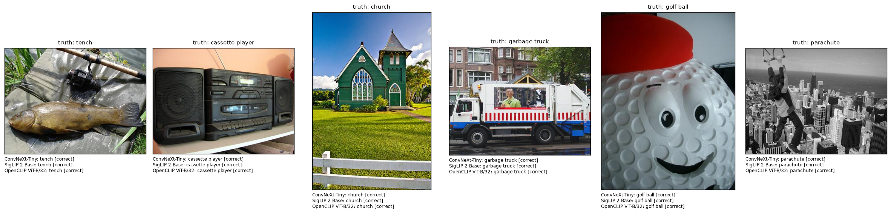

::: {.callout-note title="New here? Read this first" collapse="true"}
No prior knowledge needed — but this report is easier if you've skimmed
**[Foundations](../../foundations.qmd)** (how a computer sees an image, what a model is, how we
measure success). Stuck on a word? See the **[Glossary](../../glossary.qmd)**. Stuck on a model
name? See **[Model families](../../models.qmd)**. Key terms are explained inline the first time they
appear.
:::

## The task

**Image classification** assigns a single label to a whole image — the oldest and most
foundational CV task, and the one the deep-learning era was launched on (AlexNet on
ImageNet, 2012). Here it's also the cleanest place to see the field's biggest recent
shift, because the *same* benchmark can be attacked two completely different ways.

We evaluate on **Imagenette** — a 10-class, Apache-licensed subset of ImageNet (tench,
English springer, cassette player, chainsaw, church, French horn, garbage truck, gas
pump, golf ball, parachute) — reporting **top-1 accuracy** and latency. (*Top-1 accuracy*
means the model's single best guess was the right one; *top-5* would mean the right answer was
among its five best guesses. *Latency* is the time taken per image.)

## Two paradigms

Two very different ways to label an image. A **supervised** model is *trained on labelled
examples of exactly the classes it predicts* — show it thousands of tagged photos, and it learns
to recognise those tags. A **zero-shot** model is used on categories it was *never explicitly
trained on*, by description: you hand it the words for each class and it matches the picture to the
words. The three models below come from two families (see **[Model families](../../models.qmd)**
for the bigger picture):

- **ConvNeXt-Tiny** — a modern image-recognition network (a "convolutional" one) that was trained
  the classic supervised way on ImageNet. **timm** is just the popular open-source library that
  ships it ready to use.
- **SigLIP 2** and **OpenCLIP** — *CLIP*-style models trained on huge numbers of image–caption
  pairs scraped from the web, so a photo and its caption end up described by similar lists of
  numbers. **OpenCLIP** is an open re-creation of OpenAI's original **CLIP**; **SigLIP 2** is a
  newer, refined version of the same idea.

| Paradigm | Model here | How it decides | Changing the label set |
|---|---|---|---|
| **Supervised** | ConvNeXt-Tiny (timm) | A classification *head* trained on ImageNet outputs a score per class | Requires retraining the head |
| **Zero-shot** | SigLIP 2, OpenCLIP | Embed the image and the text `"a photo of a {class}"`; pick the closest text | Just edit the list of strings |

This is the classification analogue of closed-set vs open-vocabulary detection from
[module 01](../01-object-detection/report.qmd). The supervised model has a fixed output
space baked into its weights; the zero-shot models were trained on *image–text pairs from
the web* and have never seen Imagenette's task — yet they classify it by comparing the
image to text descriptions.

## How each model works

- **Supervised (ConvNeXt-Tiny).** A modern convolutional *backbone* — the main body of the
  network that turns an image into useful features — with a 1000-way ImageNet *head* (the small
  final part that produces a score per class). To score Imagenette we simply read off the 10
  relevant *logits* — the raw numeric scores a classifier outputs before picking the highest — no
  fine-tuning needed.
- **Zero-shot (CLIP / SigLIP 2).** Two encoders — one for images, one for text — each turning its
  input into an *embedding* (a list of numbers, or *vector*, summarising it so similar things get
  similar lists). They are trained *contrastively* so that matching image/caption pairs land
  nearby in a shared space. Classification becomes: encode the image, encode each candidate label
  as a sentence, return the nearest. **SigLIP 2** refines CLIP with a *sigmoid* loss (each pair
  judged independently) and stronger training, which generally lifts accuracy.

## How we measured

- **Data:** the full **Imagenette validation split** (3,925 images, 10 classes).
- **Metric:** top-1 accuracy. For the supervised model, the prediction is the argmax over the
  10 ImageNet logits that correspond to Imagenette's classes; for zero-shot, the argmax over
  the 10 text-similarity scores.
- **Latency:** mean of 30 warmed-up single-image forwards on the local **RTX 3090 Ti**.
- **Prompts** for zero-shot are the simple template `"a photo of a {class}."` — prompt wording
  measurably affects zero-shot accuracy, so we fix it for a fair comparison.

## Results



::: {.callout-note title="What to notice"}
- **Zero-shot is not a toy.** SigLIP 2 (**99.4%**) and OpenCLIP (**99.0%**) land within a point
  of the supervised ConvNeXt-Tiny (**99.9%**) — despite never training on Imagenette. The
  decades-old assumption that you must train *on your classes* to classify them no longer holds
  for coarse, common categories.
- **Flexibility isn't necessarily slower.** The fastest model here is the zero-shot, permissively
  licensed **OpenCLIP ViT-B/32 (99 fps, MIT)** — and it's within a point of the supervised model.
  (*FPS* = frames, i.e. images, processed per second; around 30 is fast enough for real-time
  video.) You can swap its label set by editing a list of strings.
- **SigLIP 2's recipe shows.** Its sigmoid-loss training edges OpenCLIP on accuracy
  (99.4 vs 99.0) at roughly half the throughput — a small, real accuracy/speed trade.
- **Imagenette is deliberately easy** (10 distinct classes), so everything clusters above 99%.
  The takeaway isn't the leaderboard order — it's that the *supervised advantage has nearly
  vanished* on a task like this. On fine-grained or rare classes the gap reopens.
:::

## Predictions

A handful of validation images with each model's top-1 call (`correct` / `WRONG`):

{#fig-predictions}

## Where classifiers fail

- **Fine-grained & ambiguous images** — an object photographed oddly, or a scene containing
  several classes at once (classification must commit to *one* label).
- **Zero-shot prompt sensitivity** — `"a photo of a {class}"` vs the bare class name vs an
  ensemble of templates can swing accuracy by points; the label *wording* is now a hyperparameter.
- **Distribution shift** — accuracy on clean ImageNet-style photos overstates real-world
  performance on blurry, occluded, or domain-specific imagery.

## Reproduce

```bash
uv sync --group dev
uv run python modules/02-classification/run.py        # full val (3,925 images)
```
