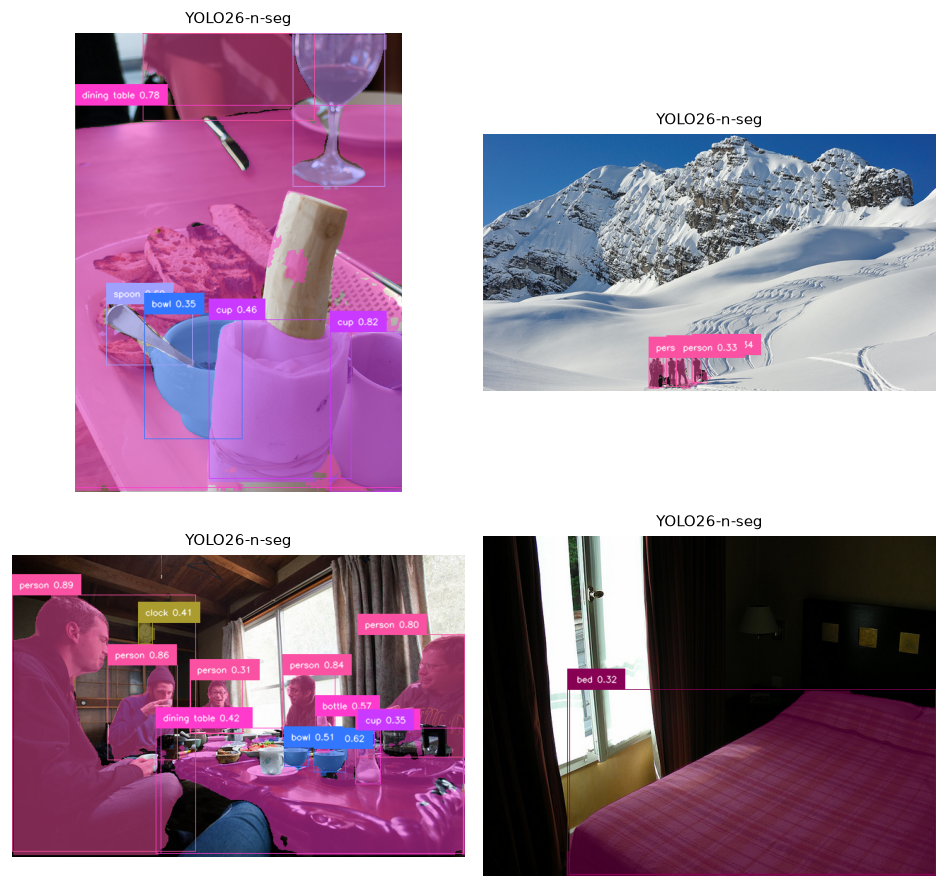
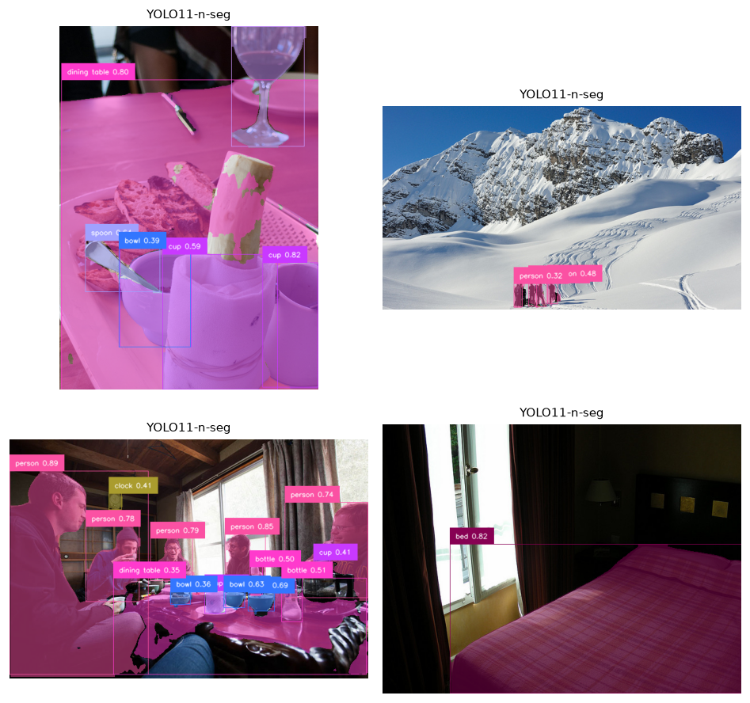
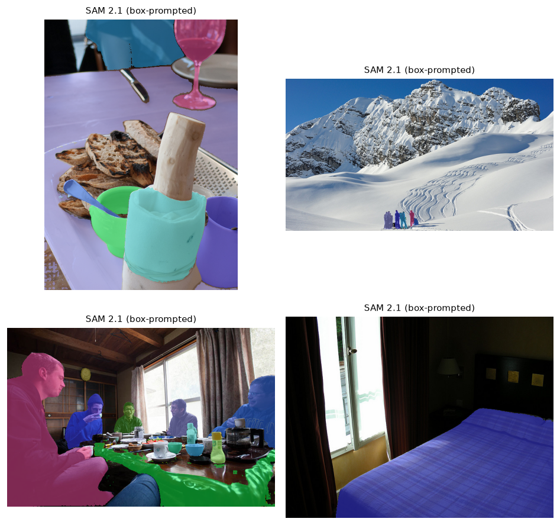

## The task

**Segmentation** assigns labels at the *pixel* level rather than the box level. Two flavours
matter here:

- **Instance segmentation** — a separate mask per object (two people → two masks), each with
  a class. This is detection + a mask head.
- **Promptable segmentation** — "segment whatever I point at / box / name", with no fixed class
  set. This is the **foundation-model** approach, embodied by Segment Anything.

## Two paradigms

| Model | Approach | Label set | Trait |
|---|---|---|---|
| **YOLO26-seg / YOLO11-seg** | Closed-set instance segmentation | 80 COCO classes | Fast; every mask comes with a class label |
| **SAM 2.1** | Promptable segmentation | *none* — class-agnostic | Segments anything from a point/box/mask prompt; no labels |

The natural way they combine is the **detect-then-segment** pipeline: a detector proposes
boxes, and SAM turns each box into a high-quality mask. We use exactly that here — SAM 2.1 is
prompted with the YOLO26-seg boxes.

## How each works

- **YOLO-seg** adds a mask-prototype head to the detector: it predicts a handful of prototype
  masks per image plus per-object coefficients that linearly combine them — cheap, hence the
  high frame-rate.
- **SAM 2.1** is a promptable transformer with a heavy image encoder and a light mask decoder.
  Encode the image once, then *any* prompt (point, box) decodes to a mask in milliseconds. It
  knows nothing about classes — it only knows "object-ness", which is why it generalises to
  things no COCO model has names for.

## How we measured

This module is **qualitative + latency** (warmed-up single-image forwards on the local
**RTX 3090 Ti**); full mask-mAP on COCO is a deeper follow-up. The point here is to *see* the
difference between a fast labelled instance segmenter and a slower, class-agnostic, promptable
one.

## Results



::: {.callout-note title="What to notice"}
- **Labels vs flexibility.** YOLO-seg runs at **~43 fps** and hands you a *class* with every
  mask — but only for its 80 COCO categories. SAM 2.1 is **~4× slower (~11 fps)** and returns
  *no* label, yet will segment anything you can point at, including objects no detector was
  trained on.
- **They compose.** The figures show the standard pattern: the detector finds and *names*
  objects; SAM refines each box into a crisp mask. Open-vocab detection (module 01) + SAM gives
  you "segment anything you can describe in words".
- **Mask quality differs from box quality.** A correct box with a sloppy mask is a common
  failure; SAM's masks are typically tighter around object boundaries than a fast instance head's.
:::

## Qualitative results

::: {layout-ncol=2}
{#fig-y26}

{#fig-y11}
:::

{#fig-sam}

## Where segmentation fails

- **Thin / wispy structures** (hair, wires, chain-link) — hard for any mask head.
- **Overlapping instances** — instance segmenters merge or split touching objects.
- **Ambiguous prompts** — a single SAM point can mean "the shirt" or "the whole person"; SAM
  resolves ambiguity by returning multiple candidate masks.
- **Class limits (instance)** — YOLO-seg simply can't mask a class it never trained on.

## Reproduce

```bash
uv sync --group detection      # ultralytics provides YOLO-seg and SAM
uv run python modules/03-segmentation/run.py --images 4
```
