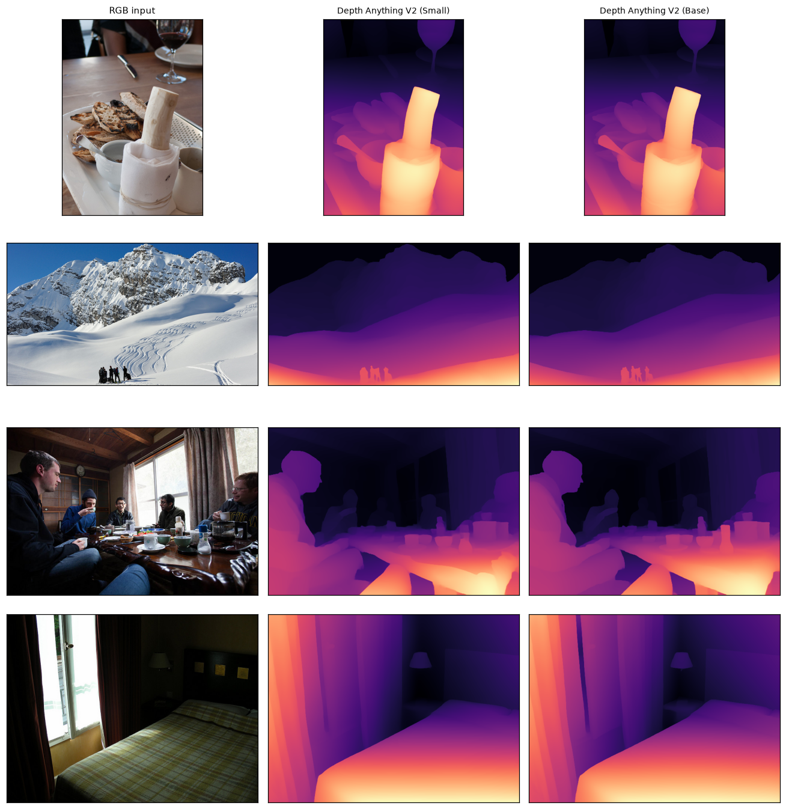

## The task

**Monocular depth estimation** predicts a distance for every pixel from one ordinary RGB
image — no stereo pair, no LiDAR. It's the perception capability most directly relevant to
**robotics**: turning a flat photo into 3D structure for navigation, grasping, and obstacle
avoidance.

A key distinction:

- **Relative depth** — orders pixels near-to-far without real-world units. Enough for "what's
  in front of what". Depth Anything V2 predicts this.
- **Metric depth** — actual metres. Needed for measurement/control; harder, and usually
  fine-tuned per camera (e.g. Depth Anything's metric heads, Apple Depth Pro).

## How it works

Depth Anything V2 is a **DINOv2 vision-transformer encoder** plus a lightweight depth head,
trained on a huge mix of labelled + pseudo-labelled images. The transformer's global
receptive field lets it use scene-wide cues — perspective, relative size, texture gradients,
occlusion — exactly the monocular cues humans use to perceive depth with one eye closed. It
outputs *inverse* depth (larger = nearer).

## Results

We run two sizes on the same images. Larger backbones generally produce sharper boundaries
and better thin-structure handling, at a latency cost.



{#fig-depth}

::: {.callout-note title="What to notice"}
- **Real 3D structure from one image.** With no stereo or sensor, the model separates
  foreground from background, recovers the ground plane, and orders objects in depth — the cue
  set a robot can turn into a rough 3D map.
- **Size buys sharpness, not speed.** Depth Anything V2 Base (~13 fps) gives crisper edges than
  Small (~26 fps); the right pick depends on whether you need real-time or best quality.
- **Relative, not metric.** These maps tell you *nearer/farther*, not *how many metres* — for
  control you'd use a metric variant calibrated to your camera.
:::

## Where monocular depth fails

- **Absolute scale ambiguity** — a doll-house and a real house look identical to a single
  camera; relative depth can't resolve true size.
- **Reflective / transparent surfaces** (mirrors, glass, water) — violate the visual cues the
  model relies on.
- **Untextured walls & sky** — few gradients to reason from.
- **Out-of-distribution cameras** — fisheye, aerial, or endoscopic views differ from the
  training mix and degrade.

## Reproduce

```bash
uv sync --group dev      # transformers provides the Depth Anything V2 pipeline
uv run python modules/04-depth/run.py --images 4
```
