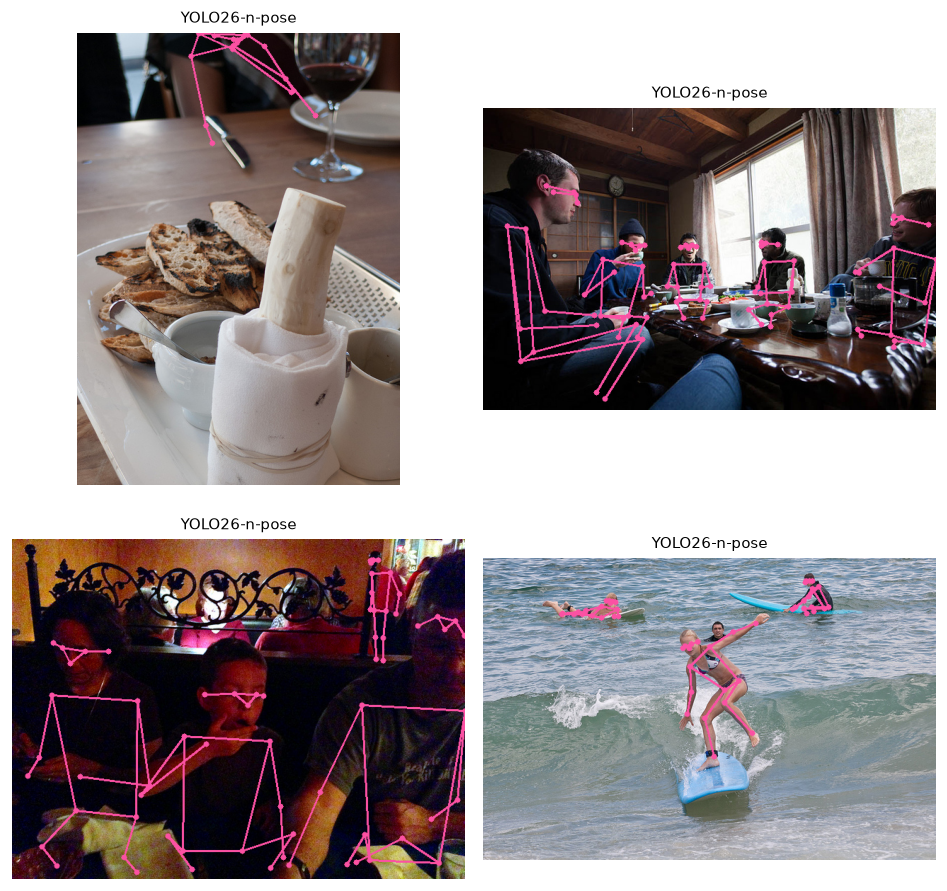
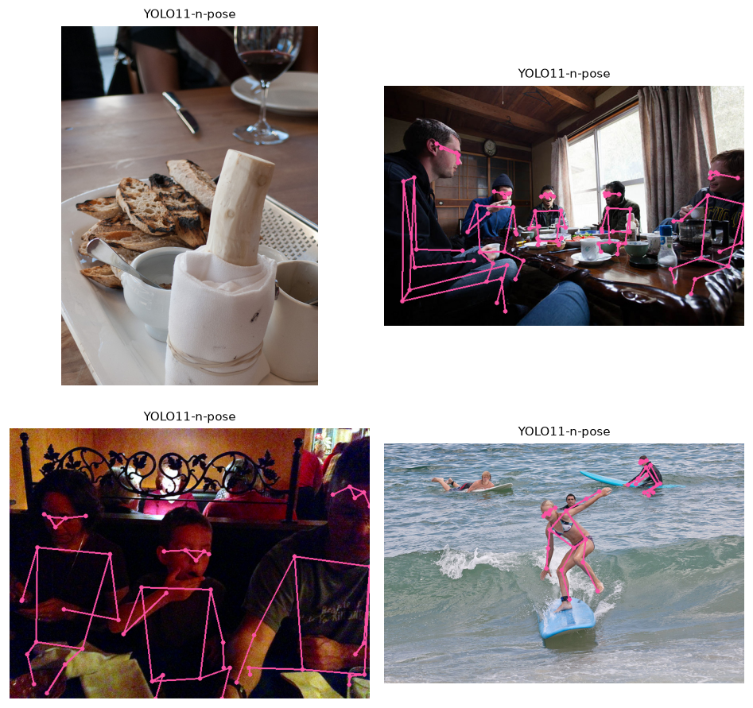

::: {.callout-note title="New here? Read this first" collapse="true"}
No prior knowledge needed — but this report is easier if you've skimmed
**[Foundations](../../foundations.qmd)** (how a computer sees an image, what a model is, how we
measure success). Stuck on a word? See the **[Glossary](../../glossary.qmd)**. Stuck on a model
name? See **[Model families](../../models.qmd)**. Key terms are explained inline the first time they
appear.
:::

## The task

**Pose estimation** — locating a person's body joints and connecting them into a skeleton —
locates a set of body keypoints per person. A **keypoint** is a single labelled point such as
"left elbow." For the COCO format, there are 17 of
them (eyes, ears, shoulders, elbows, wrists, hips, knees, ankles), connected into a
skeleton. It powers motion capture, sports analytics, gesture interfaces, and
**human-aware robotics** (a robot that must not bump the person reaching past it).

## Two paradigms

There are two broad strategies. In **bottom-up** estimation, one network finds all the people
and all their joints in a single pass; **top-down** instead first detects each person, then runs
a separate pose network on each one. A **single-stage** model does the whole job in one network
pass. The models named below — **YOLO-pose** (a fast, single-stage pose model from the YOLO
family of real-time detectors), plus the top-down **ViTPose** and **RTMPose** — are described in
more detail under [Model families](../../models.qmd).

| Paradigm | How | Trade-off |
|---|---|---|
| **Bottom-up / single-stage** (YOLO-pose here) | One network predicts people *and* their keypoints in a single pass | Constant cost regardless of crowd size; fast |
| **Top-down** (ViTPose, RTMPose) | Detect each person, then run a dedicated pose net on each crop | Usually more accurate, but cost grows with the number of people |

This module benchmarks two YOLO-pose generations (single-stage): **YOLO11-pose** (the prior
generation) and **YOLO26-pose** (the newer one). The top-down family is the
accuracy-first alternative when you have few people and need precise joints.

## How it works

YOLO-pose extends the detector: alongside each person box it regresses the 17 keypoint
coordinates (and a per-keypoint **visibility** — a confidence that the joint is actually
visible rather than hidden). Because keypoints are predicted jointly with
detection in one forward pass, throughput stays high even in crowds — you can see this in the
figures, where several skeletons are recovered at once.

## Results

The table below reports speed two ways: **latency**, the time to process one image in
milliseconds, and **FPS** (frames per second), how many images per second the model handles —
around 30 FPS or higher counts as real-time. The footnote mentions **OKS-AP**: OKS (object
keypoint similarity) is the pose world's answer to IoU — a score for how closely predicted
joints match the true ones — and is used to compute pose accuracy (AP).



{#fig-y26pose}

{#fig-y11pose}

::: {.callout-note title="What to notice"}
- **Crowd-constant speed.** Both models stay at ~50 fps whether the image has one person or
  several — the single-stage win. A top-down model would slow down as people are added.
- **A newer generation recovers more people.** YOLO26-pose found more people per image than
  YOLO11-pose here (better recall on partially-occluded figures — i.e. people partly hidden
  behind something), at a slightly lower frame-rate.
- **Keypoints carry visibility.** Occluded joints are predicted with low confidence; downstream
  code should use that, not assume every joint is reliable.
:::

## Where pose estimation fails

- **Occlusion & truncation** — joints hidden behind objects or cropped out of frame.
- **Crowding & overlap** — skeletons can swap limbs between nearby people.
- **Unusual poses** — gymnastics, lying down, or atypical viewpoints under-represented in
  training.
- **Small / distant people** — too few pixels to localise joints precisely.

## Reproduce

```bash
uv sync --group detection
uv run python modules/05-pose/run.py --images 4
```
