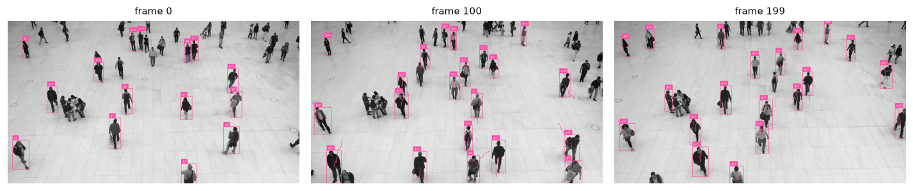

## The task

A detector answers *"what's here right now"* — independently, every frame, with no memory.
**Tracking** adds the missing dimension: **identity over time**, so the same person keeps the
same id as they move. That id is what lets you count, measure dwell time, analyse motion, or
have a robot follow a specific person.

The dominant recipe is **tracking-by-detection**:

1. Run a detector on each frame (here: YOLO26, person class only).
2. **Associate** this frame's boxes with the existing tracks — match by predicted position
   (a Kalman motion model) and box overlap.
3. Births/deaths: unmatched detections start new tracks; tracks unseen for a while are retired.

**ByteTrack** is the associator. Its trick is to use *low*-confidence detections during
association (not just high-confidence ones), which recovers objects through brief occlusion
and reduces dropped tracks.

## Result

{#fig-track}



{#fig-keyframes}

::: {.callout-note title="What to notice"}
- **Identity is the product, not boxes.** The same code as module 01 produces the boxes; the
  value here is that box `#7` in frame 0 is *the same person* as box `#7` in frame 100.
- **More ids than people = fragmentation.** This 200-frame clip yielded ~60 ids for far fewer
  actual pedestrians. When someone is occluded and reappears, the tracker often issues a *new*
  id — the classic **ID-switch / fragmentation** failure that HOTA and IDF1 are designed to
  penalise.
- **Tracking is detector-bound.** Every missed detection is a gap the associator must bridge;
  a better detector usually means a better tracker, for free.
:::

## Where tracking fails

- **Long / full occlusion** — a person hidden for many frames usually returns with a new id.
- **Crowds & similar appearance** — ByteTrack uses motion + overlap, not appearance, so it can
  swap ids between people who cross paths (appearance-based trackers like Deep OC-SORT help).
- **Fast motion / low frame-rate** — the Kalman prediction drifts and association breaks.
- **Detector misses** — propagate directly into track gaps.

## Reproduce

```bash
uv sync --group detection      # ultralytics + supervision (ByteTrack)
uv run python modules/06-tracking/run.py
```

*(The sample clip is downloaded by `supervision`'s asset helper into `data/`.)*
