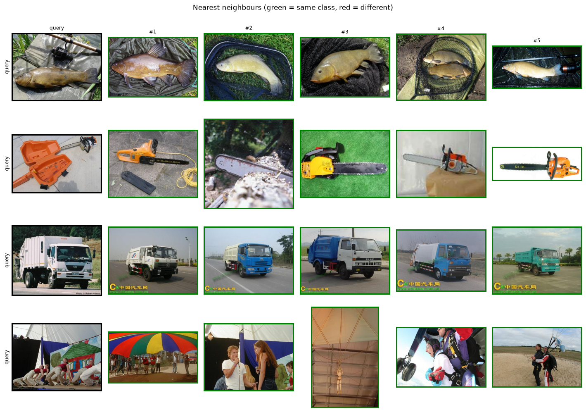

## The task

Most of this curriculum predicts *labels*. This module predicts a **vector**: an embedding
that places similar images near each other in a high-dimensional space. That single idea
underpins **reverse image search, deduplication, clustering, recommendation, anomaly
detection, and few-shot recognition** — none of which need a classifier head. To "classify"
you just look at your neighbours.

The workflow:

1. Embed every gallery image to an L2-normalised vector.
2. Embed a query the same way.
3. Rank gallery vectors by cosine similarity (a dot product) and return the nearest.

## Two kinds of embedding

| Model | Trained on | Signal it captures |
|---|---|---|
| **DINOv2** | Images only, **self-supervised** (no labels) | Visual structure, parts, texture, shape — emerges purely from the data |
| **SigLIP 2** | Image–**text** pairs, contrastive | Semantics aligned to language — "what you'd call it" |

DINOv2 learns by making different augmented views of the same image agree; it never sees a
label, yet produces features so strong that a *linear probe* rivals supervised training.
SigLIP learns from captions, so its space is organised the way *language* groups things. Both
give excellent retrieval — the right choice depends on whether you want visual or
semantic similarity.

## Results

A real metric, not just pictures: we embed a balanced Imagenette gallery and measure how often
the nearest neighbours share the query's class — **using no labels at search time**.



{#fig-retrieval}

::: {.callout-note title="What to notice"}
- **Search beats training, for free.** Both embedders retrieve the correct class **>99%** of the
  time (Recall@1) with *no* classifier and *no* labels at query time — add a new class by just
  dropping its images into the gallery.
- **Self-supervised is competitive with image-text.** DINOv2 (never saw a single label or
  caption) trails SigLIP 2 by only a few tenths of a point here — a striking result for a model
  trained purely on images.
- **This is how you'd handle an open, growing catalogue** — products, faces, defects — where
  retraining a classifier per new item is impractical.
:::

## Where retrieval fails

- **Fine-grained distinctions** — near-duplicate categories (specific dog breeds, product
  variants) can blur in a general embedding; specialised/fine-tuned embeddings help.
- **Gallery quality & scale** — retrieval is only as good as what's indexed; at millions of
  items you need an ANN index (FAISS) and recall/speed trade-offs appear.
- **Domain gap** — embeddings trained on web images underperform on medical, satellite, or
  industrial imagery without adaptation.

## Reproduce

```bash
uv sync --group dev
uv run python modules/07-retrieval/run.py --per-class 60
```
