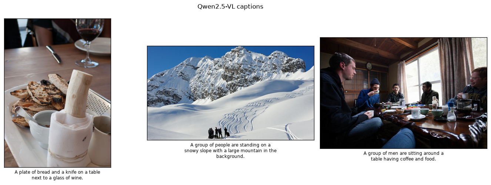

::: {.callout-note title="New here? Read this first" collapse="true"}
No prior knowledge needed — but this report is easier if you've skimmed
**[Foundations](../../foundations.qmd)** (how a computer sees an image, what a model is, how we
measure success). Stuck on a word? See the **[Glossary](../../glossary.qmd)**. Stuck on a model
name? See **[Model families](../../models.qmd)**. Key terms are explained inline the first time they
appear.
:::

## The task

Every earlier module solved *one* capability with a purpose-built model. A **vision-language
model (VLM)** — a model that takes an image (and text) and produces text: captions, answers,
reasoning — collapses many of them into a single network you steer with a **prompt** (the
instruction or question you give the model in plain language). Ask it
to caption, answer a question, count, read text, or reason about what happens next — no
task-specific head, no retraining. This is the frontier of "general" computer vision and the
closest thing here to *understanding* a scene rather than just labelling it.

## How it works

A VLM bolts a **vision encoder** (the part that turns the image into tokens the language model
can read) onto a **large language model (LLM)** — a model that generates text, like ChatGPT; a
VLM simply attaches a vision encoder to one. Image patches are projected into
the LLM's **token** space — a token being a small chunk of text (or image) the model processes
one at a time — so the model "sees" the picture as a sequence of tokens and then
*generates* text conditioned on both the image and your question (**generative** means it
produces free-form output, here text, rather than picking from a fixed list of classes). Because
the output is language, the same model can do tasks that would each need a separate architecture
in the classic stack — the prompt selects the behaviour. For how VLMs relate to the other model
families in this curriculum, see **[Model families](../../models.qmd)**.

::: {.callout-tip title="A note on the model choice"}
The natural pick here was Microsoft's **Florence-2**, a tiny unified vision-language model that
you steer with explicit task
tokens (`<CAPTION>`, `<OD>`, `<OCR>`). Its custom modelling code doesn't load under
**transformers v5** (a config incompatibility), so we use **Qwen2.5-VL 3B** — a small,
transformers-native generative VLM (the "3B" means 3 billion parameters, the model's adjustable
internal numbers) — instead. The lesson (one model, many tasks via prompts)
is the same; only the interface differs (free-form chat vs task tokens).
:::

## Results — real transcripts

Below is the model's *actual* output on three images, for four different tasks, all from the
same weights:



{#fig-captions}



::: {.callout-note title="What to notice"}
- **One model, four capabilities.** Captioning, open-ended reasoning, counting, and OCR all
  came from a single network — selected entirely by the prompt. That generality is the whole
  point of a VLM.
- **Grounded and mostly correct.** Counts (0 / 4 / 5 people) match the scenes; OCR (reading text
  that appears in an image) correctly
  reports "none" when there's no text; captions are accurate. It reasons about *what might
  happen next* — something a classifier or detector simply cannot do.
- **Generality has a price: latency.** Latency is the time to produce an answer — here measured
  in seconds, far slower than the other modules. At **~3.7 s per short answer**, this 3B VLM is
  *~100× slower* than the YOLO detector. VLMs are the heavyweight of the curriculum — you reach
  for them when you need language-level flexibility, not real-time throughput.
- **Confident but fallible.** Free-form generation can hallucinate (confidently state details
  not actually in the image);
  outputs should be treated as strong suggestions, not ground truth.
:::

## Where VLMs fail

- **Hallucination** — fluent text can assert objects/attributes that aren't there.
- **Precise spatial / counting tasks** — better than older models, still unreliable in clutter.
- **Fine OCR & small text** — general VLMs trail dedicated OCR systems on dense documents.
- **Latency & cost** — orders of magnitude heavier than the specialist models in modules 01–07.

## Reproduce

```bash
uv sync --group dev
uv run python modules/08-vlm/run.py --images 3
```
