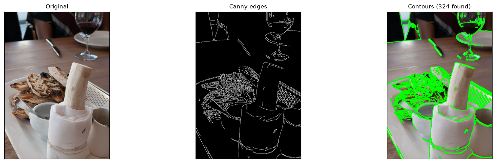
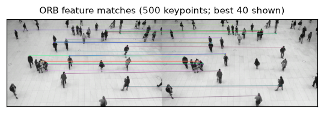
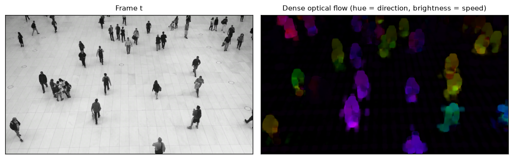

## Why this module exists

Modules 01–08 are all neural networks. This one deliberately goes back to the **pre-deep-learning**
toolkit: hand-designed algorithms from OpenCV that are **fast, transparent, deterministic, and
need no training data or GPU**. They aren't a historical curiosity — they still run inside camera
calibration, visual SLAM front-ends, image stabilisation, panorama stitching, and as cheap
preprocessing for the deep models. Seeing them makes the rest of the curriculum legible: you can
*read every line* of what these do, which is rarely true of a learned model.

## Four classics

### Edge detection & contours

The **Canny** edge detector finds intensity discontinuities (gradients), then thins and links
them into clean edges. **Contours** chain those edges into closed boundaries you can measure
(area, perimeter, shape). For decades this *was* "object detection".

{#fig-edges}

### Feature detection & matching (ORB)

**ORB** finds repeatable keypoints (corners) and encodes each as a binary descriptor, so the
*same* physical point can be matched across two images. Matching keypoints between views is the
engine behind panorama stitching, structure-from-motion, and the front-end of visual SLAM — the
hand-built ancestor of the learned embeddings in [module 07](../07-retrieval/report.qmd).

{#fig-orb}

### Optical flow

**Farneback** dense optical flow estimates a motion vector for *every* pixel between two frames —
direction as hue, speed as brightness. It's geometry, not recognition: no idea *what* is moving,
only *how*. Flow feeds stabilisation, motion segmentation, and action recognition.

{#fig-flow}

## Results



::: {.callout-note title="What to notice"}
- **Essentially free.** Canny runs in well under a millisecond; even dense optical flow is ~100 ms
  on a CPU with no model to load. Compare that to the VLM's ~3.7 s *per answer* on a 24 GB GPU.
- **Transparent and deterministic.** Every output follows from explicit math — no weights, no
  training set, same result every run. When you need to *certify* behaviour, that matters.
- **They still underpin modern systems.** SLAM, calibration, and stitching lean on features and
  flow; deep models often sit *on top of* a classical geometric backbone, not instead of it.
- **The throughline.** ORB→learned embeddings, Canny/contours→learned segmentation, optical
  flow→learned trackers: each deep module in this repo has a classical ancestor solving the same
  problem with hand-designed instead of learned features.
:::

## Where classical CV fails

- **Semantics** — it finds edges and corners, never "cat" or "pedestrian". No notion of meaning.
- **Robustness** — sensitive to lighting, blur, texture, and parameter tuning (those Canny
  thresholds are hand-set).
- **High-level tasks** — captioning, VQA, open-vocabulary anything are out of reach; that's
  exactly the gap deep learning filled.

## Reproduce

```bash
uv sync --group dev      # opencv-python only; no model downloads
uv run python modules/09-classical/run.py
```
