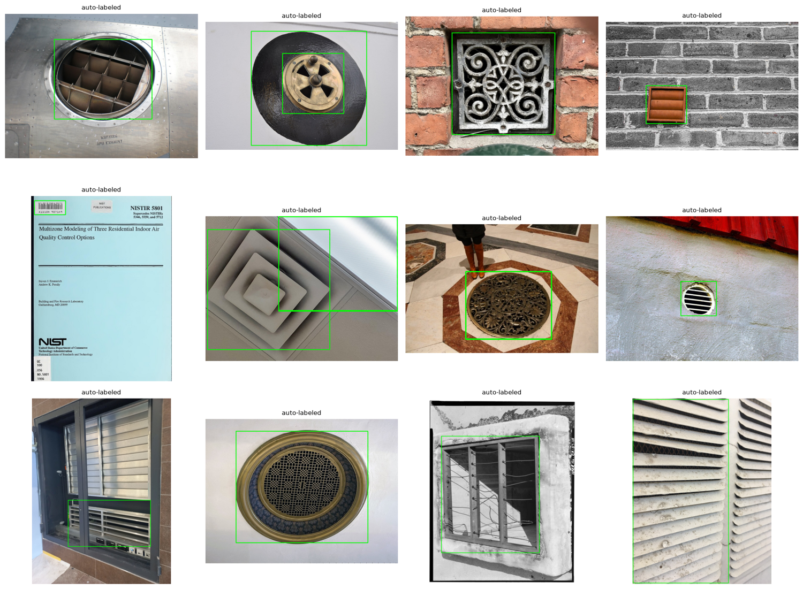
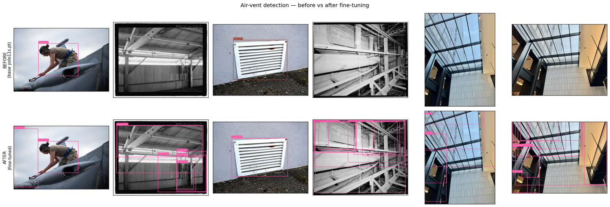
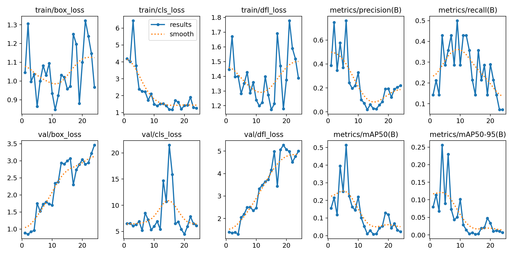

## The task

Every module so far *ran* a pretrained model. This one **trains** one — the capstone skill,
because real projects almost always need a class the off-the-shelf models don't have. Here that
class is **air vents**: not in COCO, so [module 01's](../01-object-detection/report.qmd) detectors
are blind to it. We fine-tune a YOLO detector to find vents, and — the interesting part — we do it
**without hand-labelling a single image**, then train **on the DGX Spark**.

## The data engine: this repo, labelling itself

Fine-tuning needs labelled data, and labelling is the expensive, boring bottleneck of applied CV.
So we manufacture the dataset from capabilities built earlier in this very curriculum — the
"distill an open-vocabulary model into a specialist" workflow that
[module 01](../01-object-detection/report.qmd) promised:

1. **Source** — pull Creative-Commons vent images from Wikimedia Commons (no API key).
2. **Filter (zero-shot)** — score each image with **CLIP** ([module 02](../02-classification/report.qmd))
   against vent prompts vs distractor prompts (smokestacks, landscapes, documents, **cars**,
   people…) and keep only the vent-like ones. This gate is essential — a raw "air vent" web
   search is mostly *not* air vents.
3. **Auto-label** — run **Grounding DINO** ([module 01](../01-object-detection/report.qmd)) with vent
   text prompts; its boxes (after a size-sanity filter) become YOLO labels.
4. **Fine-tune** — train YOLO on the result, on the Spark.

So three earlier modules become a **data engine** for a fourth. No human ever draws a box.

{#fig-dataset}

::: {.callout-warning title="Honest about auto-labelled data"}
Auto-sourced, auto-labelled data is **noisy** — the CLIP gate and box filter remove most junk,
but some mislabelling survives, and the val labels are themselves model-generated. So the mAP
below measures *how well YOLO distilled Grounding DINO*, not human ground truth. The qualitative
before/after and the honest "what's needed for production" note matter more than the number. The
path to **highly reliable** is more images and a pass of human label cleanup — or your own
photos, which the pipeline accepts directly.
:::

## Why the DGX Spark

Inference runs anywhere; **training** is where compute and memory matter, and it's where this
project's scale-up box earns its place: the **GB10 Grace-Blackwell** with ~120 GB unified memory
(ARM64, CUDA 13). Training also happens to be the operation you'd repeat as the dataset grows and
the model gets larger, so it belongs on the Spark — which is also the robotics deployment target
these perception skills feed. (See [Cross-platform validation](../../cross-platform.qmd) for how
the same code runs on both machines.)

The training ran inside the Spark's NGC PyTorch container; the dataset was built on the local
3090 Ti (Grounding DINO + CLIP) and shipped over.

## Results — before vs after

The headline: the **base** model has no "air vent" class, so it detects **zero** vents. The
**fine-tuned** model localises them.

{#fig-beforeafter}



{#fig-curves}

::: {.callout-note title="What to notice"}
- **From zero to a working detector.** The base model cannot detect a vent — there is no such
  class — so "before" is a blank. After 80 epochs on **33 auto-labelled images** (trained in
  **under a minute** on the GB10 at ~0.5 s/epoch), the model localises vents and louvers the base
  model is blind to. That capability did not exist an hour earlier and required **no manual
  labelling**.
- **The numbers are modest, and honestly so.** mAP@50 ≈ 0.40 on a 9-image val split — respectable
  for a few dozen noisy auto-labelled examples, but not "production reliable". The val labels are
  themselves pseudo-labels, so treat the figure as distillation fidelity, not ground truth.
- **The workflow is the deliverable.** Source → CLIP-filter → Grounding-DINO-label → fine-tune is a
  repeatable recipe for *any* new class. Scaling the image count, a short human label-cleanup pass,
  and adding on-site photos are the obvious, high-leverage levers to push reliability up from here.
- **The Spark did the training; the laptop built the data.** The exact same code trains on ARM64 /
  GB10 / CUDA 13 as on the x86 / 3090 Ti — the [cross-platform](../../cross-platform.qmd) story in
  practice.
:::

## How to reproduce

```bash
# 1) Build the dataset locally (Grounding DINO + CLIP on the GPU)
uv run python modules/10-finetuning/prepare_data.py --max-images 200

# 2) Ship it to the Spark and train inside the NGC container
#    (Tailscale SSH alias `spark`; dataset tar'd over, docker-cp'd into mjlab-dev)
python finetune.py --data data/airvents/data.yaml --model yolo11s.pt --epochs 80 --out out
```

## Where fine-tuning (this way) falls short

- **Data volume & noise** — a few dozen auto-labelled images demonstrates the workflow and a
  real before→after, but "highly reliable" needs hundreds of cleaner examples.
- **Pseudo-label ceiling** — the student can't exceed the teacher; Grounding DINO's mistakes become
  the model's mistakes. A short human cleanup pass is the highest-leverage next step.
- **Domain match** — web vents ≠ your building's vents; a handful of on-site photos added to the
  set would lift real-world reliability fast.
